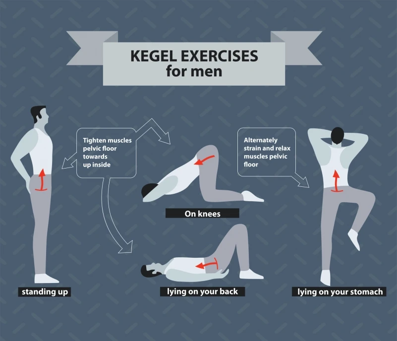

最近，我正在按照这个方法练习。感觉很有效果，特别是每天提肛运动，还治好了我久坐便秘的病症

涉及的ooxx的姿势术语懂的都懂，图片不贴了。

## 俯卧撑
传教士式是一个相当基本的做爱姿势，但其实对手臂和下背的肌肉都有不低的要求，所以我会建议大家做Hindu push-up。

起手式为双手双脚放在地方而成A字撑起，然后做一下掌上压，再将上身推前，然后头仰高。建议可以每次做10下，休息30秒，合共做4组。

## 提肛训练
女上男下，就别以为男士可以很空闲，其实男士的上下摆动都可以加强做爱时的快感。所以提肛训练绝对可以一举两得。

站着练习，躺着练习，趴着练习，随时练习。自我感觉这是性价比最高的运动方式。建议可以每次做10下，休息30秒，合共做4组。

## 高抬腿跑

狗仔式，你以为自己所用到的肌肉是臀部，其实大多数以大腿肌肉来带领自己前进，如果想做好，就要好好训练大腿，而高抬脚跑绝对适合。

因为大家在做爱时都是一个带氧运动，而高抬脚跑可以训练心肺，同时训练大脚肌肉。建议可以每次做60秒，休息30秒，合共做4组。

## 小结

健康比性更重要。所以，从健康的角度练习，坚持的会更长久。

身体健康，性爱欢愉。生活的烦恼减少90%。剩下的10%可以使用健康的身体，欢愉后的动力克服，挑战，战胜。

